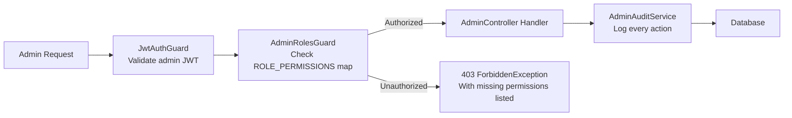

# CardIQ Admin Platform Architecture

## Overview
The CardIQ Admin Console is the **internal operations layer** — a role-gated, audit-safe platform for managing all live data, workflows, and system health.

## RBAC Permission Matrix

| Role | Key Permissions |
|---|---|
| `SUPER_ADMIN` | All permissions |
| `ADMIN` | Cards, rules, merchants, flags, scrapers, audit |
| `OPERATIONS_MANAGER` | Read cards/rules/merchants, scraper controls, queue management |
| `DATA_VERIFIER` | Card/rule write, merchant approval, audit read |
| `CONTENT_MANAGER` | Card write, merchant read, audit read |
| `SUPPORT_AGENT` | Card read, user read, audit read |
| `ANALYTICS_VIEWER` | Card/rule/AI read only, audit read |

## Security Model

Every admin action:
1. Requires a valid JWT with `adminRole` claim
2. Is permission-checked against the role matrix
3. Is logged to `admin_audit_logs` with `previousValue` and `newValue`
4. Returns structured errors for unauthorized attempts

## Approval Workflows

| Entity | Trigger | Action |
|---|---|---|
| Merchant | `verificationStatus = 'unverified'` | Approve / Reject / Merge |
| Benefit Change | `requiresReview = true` | Mark Reviewed |
| User | Abuse report | Suspend / Reinstate |

## Feature Flag System
Flags are evaluated **deterministically** — identical `(flagKey, userId)` pairs always resolve to the same rollout bucket. The hash function: `abs(hash(key + userId)) % 100 < rolloutPercentage`. Kill switches override all rollout logic and immediately disable the flag.

## API Summary

| Method | Endpoint | Permission |
|---|---|---|
| GET | `/api/admin/system-health` | `card:read` |
| GET/POST/PUT/DELETE | `/api/admin/cards` | `card:read` / `card:write` / `card:delete` |
| GET/POST/PUT | `/api/admin/rules` | `rule:read` / `rule:write` |
| GET | `/api/admin/merchants/review` | `merchant:read` |
| POST | `/api/admin/merchants/approve` | `merchant:approve` |
| POST | `/api/admin/merchants/merge` | `merchant:merge` |
| GET/POST | `/api/admin/scrapers` | `scraper:read` / `scraper:retry` |
| GET/PUT | `/api/admin/feature-flags` | `flag:read` / `flag:write` |
| GET | `/api/admin/audit-logs` | `audit:read` |
| POST | `/api/admin/users/:id/suspend` | `user:moderate` |

## Audit Events Tracked

`CARD_CREATED`, `CARD_UPDATED`, `CARD_DELETED`, `RULE_CREATED`, `RULE_UPDATED`, `MERCHANT_APPROVED`, `MERCHANT_REJECTED`, `MERCHANT_MERGED`, `SCRAPER_RETRY`, `FLAG_UPDATED`, `USER_SUSPENDED`, `USER_REINSTATED`, `CACHE_INVALIDATED`

Each event stores: `adminId`, `adminEmail`, `adminRole`, `action`, `entityType`, `entityId`, `previousValue`, `newValue`, `ipAddress`, `sessionId`, `timestamp`.
