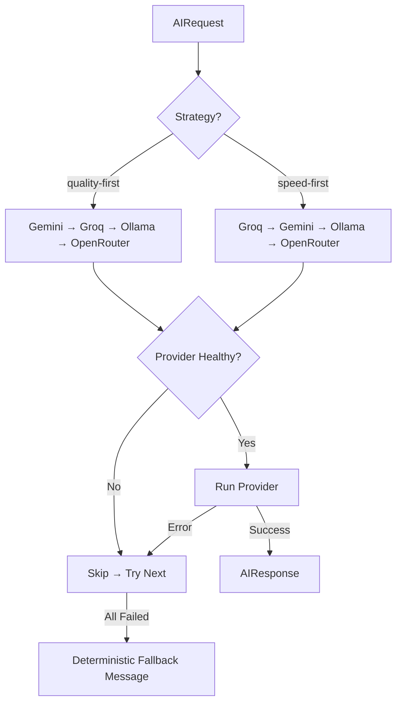
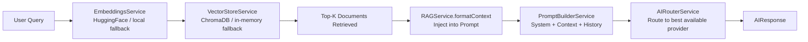

# CardIQ AI Infrastructure Architecture

## Core Principle
The AI layer **explains and contextualizes** — it never calculates. All financial numbers come from deterministic engines (Phases 4–6). The AI receives pre-computed data and converts it to natural language.

## Provider Routing

## RAG Pipeline

## Hallucination Prevention
Every prompt template includes explicit guardrails:
1. **Forbidden**: Inventing reward rates, cashback %, or card benefits.
2. **Required**: All financial numbers must come from the `CONTEXT DATA` block.
3. **Required**: If data is absent, the AI must say so explicitly.
4. **Enforced**: Temperature is kept at 0.2 for explanation tasks (low creativity, high accuracy).

## Streaming Architecture
- Backend: NestJS SSE via `res.write('data: ...\n\n')` through `StreamingService`
- Frontend: Fetch API + ReadableStream in `useAIStream` hook
- Each SSE chunk carries `{ delta, provider }` — UI shows which provider is active in real time
- Cancellation: `AbortController` cleanly stops the fetch

## Provider Health Monitoring
`ProviderHealthService` caches health results for 60 seconds. A provider that throws during routing is instantly marked unhealthy. The cache refreshes on the next request after TTL expiry.

## Security
- **Prompt injection**: `PromptBuilderService.sanitize()` strips known jailbreak patterns
- **Input length cap**: User messages hard-capped at 2000 characters
- **History truncation**: Only last 10 turns injected into context
- **Context truncation**: Context blocks hard-capped at ~12,000 characters

## Caching
- AI responses cached by SHA-256 of `(type, messages, maxTokens, temperature)`
- Embeddings cached by MD5 of text content (24h TTL)
- Streams are never cached (bypass via `request.stream === true` check)
