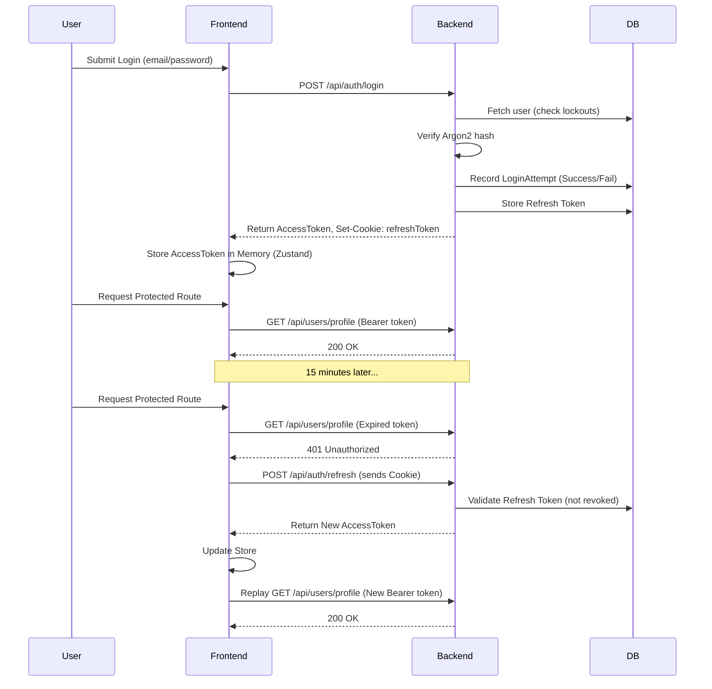

# CardIQ Authentication Architecture

This document describes the Phase 2 implementation of the CardIQ Authentication, Authorization, and Security Foundation.

## Token Lifecycle

We employ a dual-token architecture to maximize security while providing a seamless user experience.

1. **Access Token (JWT)**
   - **Lifespan**: 15 minutes.
   - **Storage**: Frontend memory (Zustand `authStore`). NEVER stored in `localStorage` to prevent XSS exfiltration.
   - **Usage**: Sent as an `Authorization: Bearer <token>` header with API requests.

2. **Refresh Token (JWT)**
   - **Lifespan**: 7 days.
   - **Storage**: Secure, `httpOnly`, `sameSite: strict` cookie.
   - **Database**: Hashed and stored in the `refresh_tokens` PostgreSQL table. This allows us to instantly revoke tokens across devices or when suspicious activity is detected.

## Authentication Flow Diagram

## Security & Abuse Prevention

> [!WARNING]
> To protect against brute force and credential stuffing, the following rules are enforced:

- **Argon2 Hashing**: We use `argon2id` which is resistant to GPU cracking and side-channel attacks.
- **Login Throttling**: 5 consecutive failed logins will lock the account for 15 minutes.
- **Audit Logs**: Every login attempt (success and failure) is logged in `login_attempts` with IP and User-Agent.
- **Middleware**: Next.js middleware blocks unauthenticated access before pages are even rendered.
