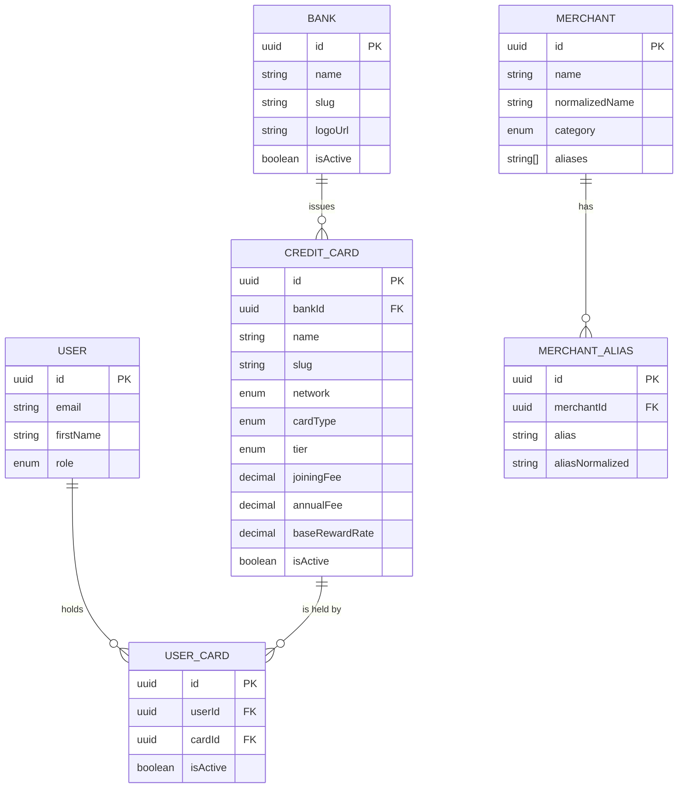

# CardIQ Database Architecture

This document describes the Phase 1 implementation of the CardIQ database architecture using PostgreSQL 15+ and TypeORM.

## Core Schema Principles
- **UUID Primary Keys**: Every table uses a `uuid-ossp` generated `id`.
- **Soft Deletes**: Every entity uses `deletedAt` for audit safety and data recovery.
- **Auditing**: `createdAt` and `updatedAt` are strictly managed via TypeORM.

## High-Level Entity Relationship Diagram (ERD)

## Indexing Strategy

> [!TIP]
> The database is heavily optimized for search using PostgreSQL extensions.

1. **pg_trgm**: Applied to `MerchantEntity.normalizedName` to allow for rapid fuzzy matching and alias detection.
2. **Standard Indices**: Applied to commonly queried fields like `slug`, `bankId`, `userId`, `isActive`.
3. **Unique Indices**: Enforced on `email` (Users) and `slug` (Banks, Cards, Merchants) to ensure deterministic data resolution.

## Seeding Infrastructure
The database includes an idempotent seeding strategy (`seed-banks.ts`, `seed-credit-cards.ts`, `seed-merchants.ts`). 
It securely drops the initial deterministic mapping of 24 Indian banks, 50 major credit cards, and top Indian merchants without duplicates.
