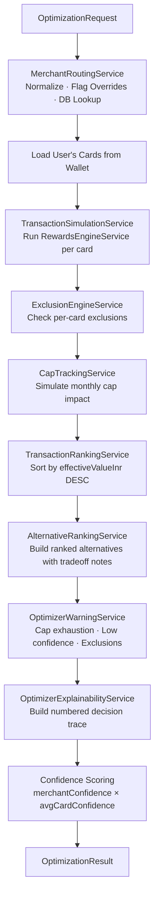

# CardIQ Transaction Optimizer Engine Architecture

## Overview
The Optimizer answers the single most important user-facing question in CardIQ: **"Which card should I use right now?"**

It is a 14-step deterministic pipeline that processes a raw merchant transaction, resolves its identity, simulates rewards across all user-owned cards, and returns a ranked result with full explainability in sub-200ms.

## 14-Step Execution Pipeline

## Ranking Logic
Cards are ranked purely by `effectiveValueInr` — the INR-normalized value of whatever reward type (cashback, points, miles) the card earns. This ensures we compare a ₹250 cashback and 500 points worth ₹2.50 each (= ₹1250) on the same scale.

## Cap Awareness
The `CapTrackingService` (from Phase 4) is re-used inside the simulation step. If a card's monthly cashback cap is partially exhausted, the simulated reward is automatically reduced to reflect only the remaining eligible amount.

## Batch Optimization
`BatchOptimizerService` runs individual optimizations in parallel (`Promise.all`) and aggregates:
- Total estimated rewards across the basket
- Per-card usage summary (how many transactions each card wins)
- Fallback warnings

## API Summary

| Endpoint | Purpose |
|---|---|
| `POST /api/optimizer/suggest` | Single transaction — returns best card |
| `POST /api/optimizer/batch` | Array of transactions — aggregated |
| `POST /api/optimizer/alternatives` | Best card + alternatives only |
| `POST /api/optimizer/simulate` | Full debug mode — complete trace |

## Performance Targets
- **Single transaction**: sub-200ms (parallel card simulation)
- **Batch (20 transactions)**: sub-500ms
- **Cache key**: SHA-256 of `merchantName + amount + userId + cardIds`
