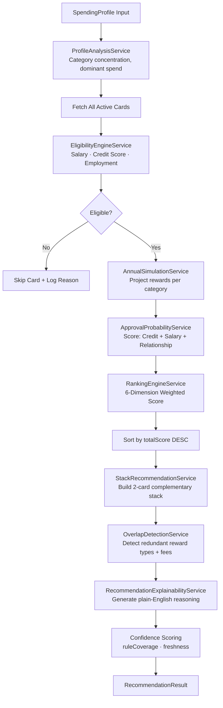

# CardIQ Recommendation Engine Architecture

## Overview
The Recommendation Engine is a purely **deterministic, 11-step financial optimization pipeline**. No AI is used to rank cards. All outputs are reproducible from the same `SpendingProfile` input.

## 11-Step Execution Flow

## Ranking Weights

| Dimension | Weight |
|---|---|
| Cashback / Reward Alignment | 28% |
| Benefit Coverage | 20% |
| Fee Efficiency | 18% |
| Approval Likelihood | 16% |
| Travel Alignment | 12% |
| Lifestyle Alignment | 6% |

## Stack Optimization Logic
The `StackRecommendationService` builds a **complementary 2-card stack** by:
1. Taking the highest-ranked card as `primary`.
2. Finding the highest-ranked card with a **different reward type** as `secondary`.
3. Assigning spending categories to the most appropriate card.
4. Flagging overlapping reward types or duplicate lounge access.

## Confidence Scoring
- Drops when cards have no matching reward rules (zero simulated rewards).
- Penalized when `creditScore` is absent for premium cards.
- Freshness score reflects query latency (< 500ms = 100%).
