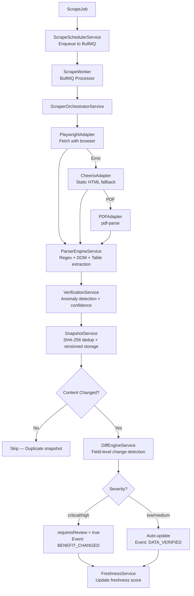

# CardIQ Scraper Architecture

## Core Principle
**Live scraping MUST NEVER overwrite verified historical data directly.** All changes are tracked, versioned, and stored as `BenefitChangeEntity` records requiring review before they affect the live rewards engine.

## 14-Step Scrape Pipeline

## Adapter Fallback Chain

| Priority | Adapter | Use Case |
|---|---|---|
| 1 | `PlaywrightAdapter` | Dynamic JS-rendered pages |
| 2 | `CheerioAdapter` | Static HTML, SSR pages |
| 3 | `PDFAdapter` | T&C and benefits PDFs |
| 4 | Last verified snapshot | All adapters failed |

## Change Severity Scoring

| Field | Severity |
|---|---|
| `rewardRate` | **critical** |
| `monthlyCap` | **high** |
| `annualFee` | **high** |
| `loungeAccessCount` | medium |
| `exclusions` | medium |
| `benefits` | low |

## Freshness Decay
Freshness score decays from 100 to 0 over 72 hours. Verified data decays slower; flagged data starts with a 30-point penalty. The next scrape is scheduled adaptively:
- Score ≥ 80: scrape every 24h
- Score 50–80: scrape every 12h
- Score < 50: scrape every 6h

## Queue Architecture (BullMQ)
- Queue: `scrape-queue` (Redis-backed)
- Priority: 1 = urgent, 5 = default, 10 = low
- Retry: 3 attempts with exponential backoff (2s, 4s, 8s)
- Dead-letter: Failed jobs preserved with `lastError` for admin review

## Events Emitted

| Event | Trigger |
|---|---|
| `SNAPSHOT_CREATED` | Every successful scrape |
| `BENEFIT_CHANGED` | Diff detected between snapshots |
| `DATA_VERIFIED` | Confidence ≥ 80 after parse |
| `SCRAPE_FAILED` | All retries exhausted |

## API Summary

| Endpoint | Purpose |
|---|---|
| `POST /api/scraper/run` | Enqueue a single scrape job |
| `POST /api/scraper/run-all` | Trigger all 12 bank refreshes |
| `POST /api/scraper/retry` | Re-queue a failed job |
| `GET /api/scraper/jobs` | Job history |
| `GET /api/scraper/snapshots?bank=HDFC` | Snapshot history for a bank |
| `GET /api/scraper/changes` | Detected benefit changes (review queue) |
| `GET /api/scraper/failures` | Failed jobs |
| `GET /api/scraper/source-health` | Per-bank success rate |
